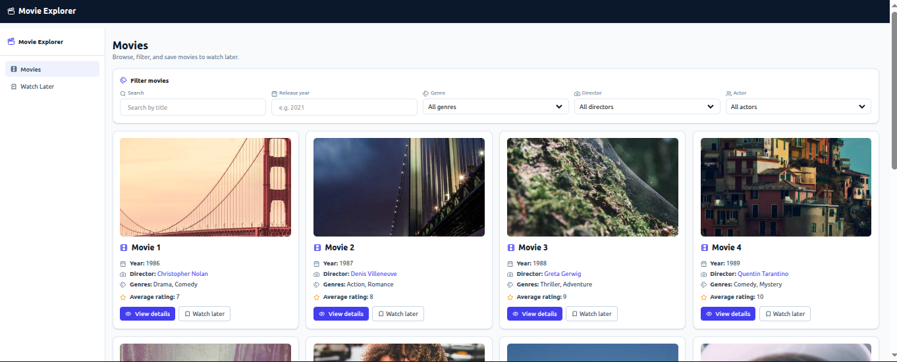

# Movie Explorer Platform

Full-stack Movie Explorer application for browsing movies, actors, directors, genres, and movie reviews.

## Stack

- Backend: Flask + SQLAlchemy + flask-smorest (OpenAPI/Swagger)
- Frontend: React + Vite + TypeScript + Tailwind CSS
- Database: SQLite (local runtime default)
- Testing/Linting:
  - Backend: `pytest`, `ruff`
  - Frontend: `vitest`, `eslint`

## Features

- Browse movie list with key details (title, release year, genres, director).
- Filter/search movies by genre, actor, director, and title.
- Paginated movie listing with configurable page size.
- Movie detail page with cast, director, genres, synopsis, and reviews.
- Actor profile page with filmography.
- Director profile page with filmography.
- Ratings/reviews included as API resource.
- Watch Later page using localStorage (no auth).
- Edge cases covered (empty data states, invalid filter types, not found records).

## UI Preview



## API Docs

When backend is running:

- Swagger UI: [http://localhost:8000/swagger-ui](http://localhost:8000/swagger-ui)

## Local Development

### Backend

```bash
cd backend
make install
make seed
make run
```

### Frontend

```bash
cd frontend
npm install
npm run dev
```

Frontend runs on `http://localhost:5173` and expects backend at `http://localhost:8000`.

## Docker (Run Full Stack)

```bash
docker compose up --build
```

- Frontend: `http://localhost:5173`
- Backend: `http://localhost:8000`
- Docker setup auto-seeds demo data on backend startup.

## Database file in Git

Do not commit SQLite DB binaries to Git.  
Use `backend/seed.py` (or Docker Compose) to generate demo data consistently.

## Build/Quality Gates

### Backend

```bash
cd backend
make build
```

### Frontend

```bash
cd frontend
npm run build
```

The build steps include linting and unit tests.
